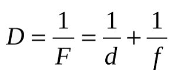
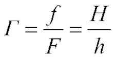

# Рабочий лист к уроку физики

**Дата:** 04.05.2023

**ФИО учителя:** Акматова Н.А.

**Класс:** 11б

**Тема урока:** Формула тонкой линзы. Увеличение линзы.

**Образовательные ресурсы:** учебник, сетевой город, электронная почта.

**Цель урока:** повторить формулу тонкой линзы.

## Теоретическая часть

Формула линзы: 

Увеличение линзы: 

- D – оптическая сила линзы [дптр], 	
- Г – увеличение линзы
- F – фокусное расстояние линзы [м],	 
- H и h – высота предмета и изображения [м]
- F>0 – собирающая линза, 
- F<0 – рассеивающая линза

Пример: 

## Практическая часть

Для закрепления пройденного материала решите задачу:

    Рассматривая предмет в собирающую линзу, его располагают на расстоянии 4 см от нее. При этом получают мнимое изображение, в 5 раз большее самого предмета. Какова оптическая сила линзы?

**Обратная связь:** решение задачи отправьте мне сегодня на почту в сетевом городе до 19ч.