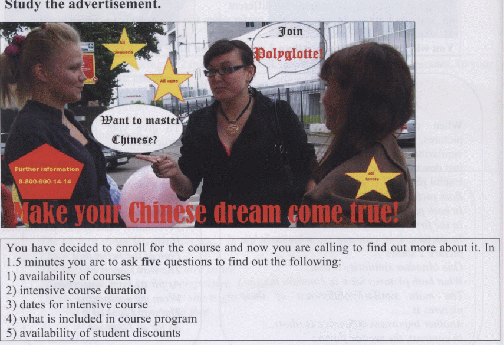

# 13.05.23 / English / Questions only
## Put the verbs into correct form in either ACTIVE or PASSIVE voice.
- He was born in a little town in a family that could hardly (1) ... (CALL) a sporty one.
- The parents and four kids (2) ... (LIVE) in a tiny flat 
- That was probably one of the reasons that (3) ... (MAKE) Yuri choose his hobby.
- While most of his classmates were watching TV, practicing music or making model aircraft, the kid (4) ... (KICK) a ball in the yard whatever the weather.
- Once a professional coach, who (5) ... (ARRIVE) at the town for a qualifying round, spotted him when he (6) ... (PLAY) in an amateur football game. 
- He found the boy promising and Yuri (7) ... (INVITE) to join a junior club in Moscow.
- In fact, he was a bit too old for professional sport, and not many people believed that he (8) ... (GAIN) any profound success. But he did.
- In several years Yuri (9) ... (BECOME) one of the most popular professional footballers. 
- “I (10) ... (NEVER/SEE) a person so dedicated to football,” says one of his fans, and the others definitely share the opinion.

## Form the right part of speech. 
- The ... got an international prize. INVENT
    1. invention
    2. inventor
    3. invential
- A huge amount of forests ... every year. It may lead to the  extinction of many species.APPEAR
    1. apperance
    2. disappear
- You are never too old to go to college and gain some ... . QUALIFY
    1. qualification
    2. quality
- Lying to your dad like that was really ... . DISHONESTY
    1. honest
    2. dishonestic
    3. dishonest
- If you make a good ... at the interview, you will get the job. IMPRESS
    1. impression
    2. impressive

## Ask 5 questions

You have decided to enroll for the course and now you are calling to find out more about it. In 1.5 minutes you are to ask five questions to find out the following:
1. availability of courses
2. intensive course duration
3. dates for intensive course
4. what is included in course program
5. availability of student discounts

# 13.05.23 / English / Questions and answers
## Put the verbs into correct form in either ACTIVE or PASSIVE voice.
- He was born in a little town in a family that could hardly (1) **be called** a sporty one.
- The parents and four kids (2) **lived** in a tiny flat 
- That was probably one of the reasons that (3) **made** Yuri choose his hobby.
- While most of his classmates were watching TV, practicing music or making model aircraft, the kid (4) **was kicking** a ball in the yard whatever the weather.
- Once a professional coach, who (5) **had arrived** at the town for a qualifying round, spotted him when he (6) **was playing** in an amateur football game. 
- He found the boy promising and Yuri (7) **was invited** to join a junior club in Moscow.
- In fact, he was a bit too old for professional sport, and not many people believed that he (8) **would gain** any profound success. But he did.
- In several years Yuri (9) **became** one of the most popular professional footballers. 
- “I (10) **have never seen** a person so dedicated to football,” says one of his fans, and the others definitely share the opinion.

## Form the right part of speech. 
- The **invention** got an international prize.
- A huge amount of forests **disappear** every year. It may lead to the  extinction of many species.
- You are never too old to go to college and gain some **qualification**.
- Lying to your dad like that was really **dishonest**.
- If you make a good **impression** at the interview, you will get the job.

## Ask 5 questions

You have decided to enroll for the course and now you are calling to find out more about it. In 1.5 minutes you are to ask five questions to find out the following:
1. availability of courses - **Can you tell me about the availability of your courses?**
2. intensive course duration - **How long is the intensive course duration?**
3. dates for intensive course - **What are the dates for the intensive course?**
4. what is included in course program - **Can you provide more information about what is included in the course program?**
5. availability of student discounts - **Do you offer any student discounts for the course?**

# 13.05.23 / English / Answers only
## Passive or Active Voice
1. be called
2. lived
3. made
4. was kicking
5. had arrived
6. was playing
7. was invited
8. would gain
9. became
10. have never seen

## Form the right part of speech.
1. invention
2. disappear
3. qualification
4. dishonest
5. impression

## Ask 5 questions
1. Can you tell me about the availability of your courses?
2. How long is the intensive course duration?
3. What are the dates for the intensive course?
4. Can you provide more information about what is included in the course program?
5. Do you offer any student discounts for the course?
