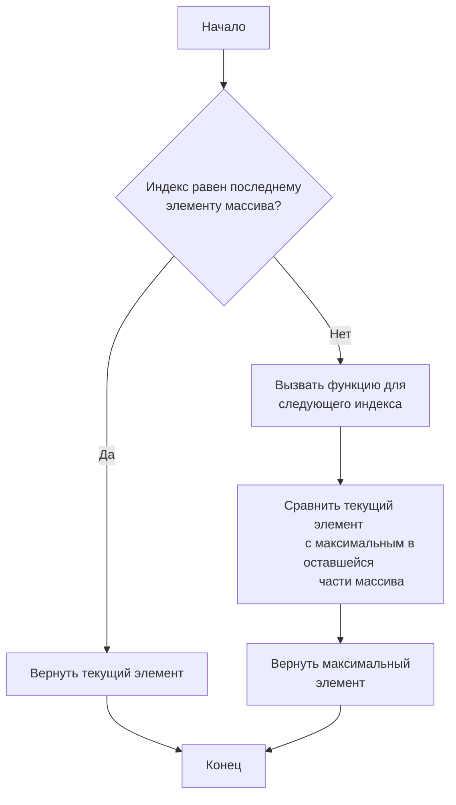
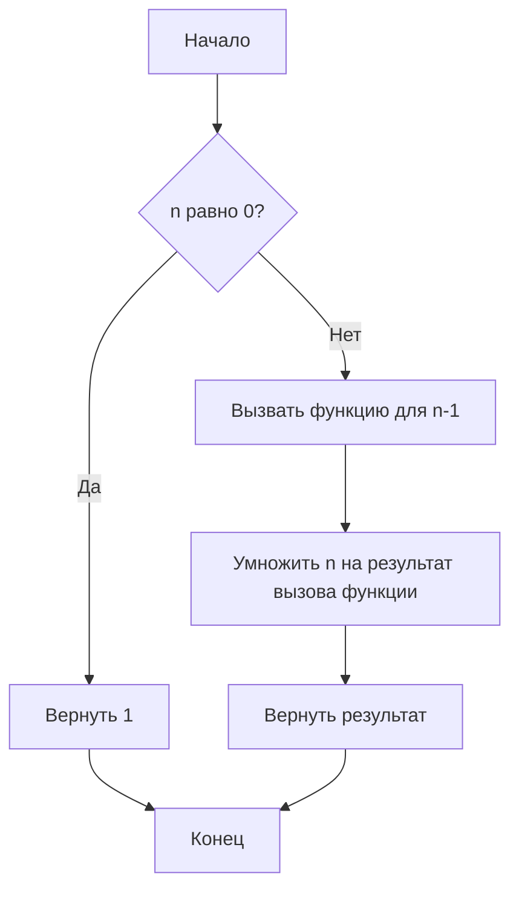
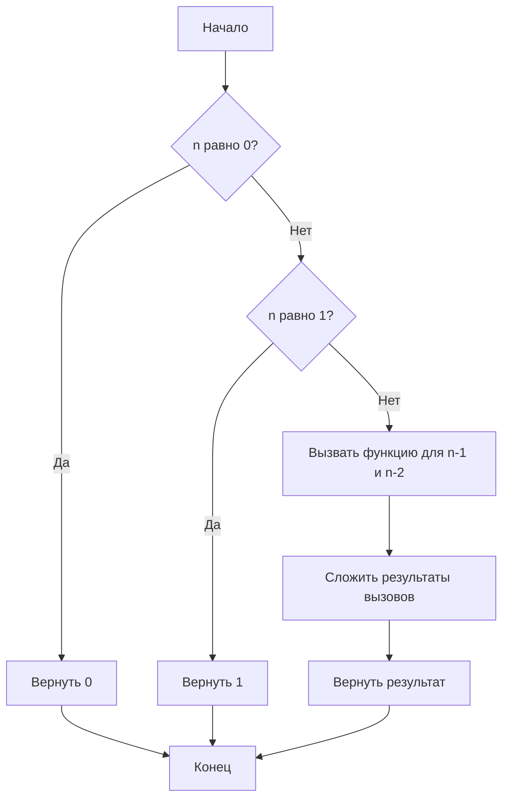
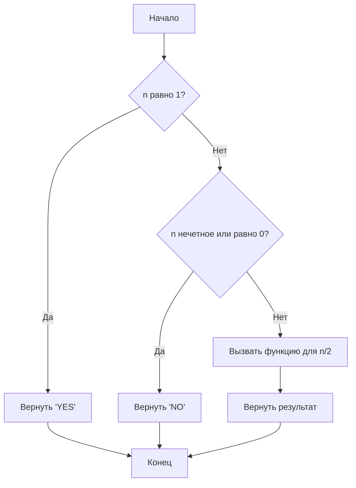
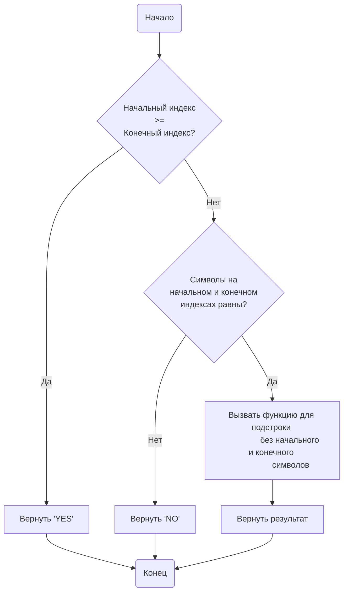

## Лабораторная работа № 4: Рекурсия и программирование рекурсивных функций в C#

### Цель работы:
Изучение принципов работы рекурсии и разработка рекурсивных функций для решения поисковых задач на языке программирования C#.

### Теория:
Рекурсия в программировании — это метод, при котором функция вызывает саму себя, непосредственно или косвенно, до тех пор, пока не будет достигнуто базовое условие (условие остановки). Это позволяет решать сложные задачи путем их разбиения на более простые подзадачи.

### Задания:

#### Задание 1: Поиск максимального элемента в массиве
##### Код на языке C#:
```csharp
using System;

class Program
{
    static int FindMax(int[] array, int index)
    {
        if (index == array.Length - 1)
            return array[index];
        
        int maxInRestArray = FindMax(array, index + 1);
        
        return Math.Max(array[index], maxInRestArray);
    }

    static void Main()
    {
        int[] array = { 1, 5, 3, 9, 2, 8 };
        int max = FindMax(array, 0);
        Console.WriteLine($"Maximum element in array: {max}");
    }
}
```

##### Схема:


##### Сложность:
O(n), где n — длина массива.

#### Задание 2: Вычисление факториала числа
##### Код на языке C#:
```csharp
using System;

class Program
{
    static int Factorial(int n)
    {
        if (n == 0)
            return 1;
        
        return n * Factorial(n - 1);
    }

    static void Main()
    {
        int number = 5;
        int result = Factorial(number);
        Console.WriteLine($"Factorial of {number} is {result}");
    }
}
```

##### Схема:


##### Сложность: 
O(n), где n — значение числа.

#### Задание 3: Поиск числа Фибоначчи
##### Код на языке C#:
```csharp
using System;

class Program
{
    static int Fibonacci(int n)
    {
        if (n == 0)
            return 0;
        if (n == 1)
            return 1;
        
        return Fibonacci(n - 1) + Fibonacci(n - 2);
    }

    static void Main()
    {
        int number = 6;
        int result = Fibonacci(number);
        Console.WriteLine($"Fibonacci number at position {number} is {result}");
    }
}
```

##### Схема:


##### Сложность: 
O(2^n) — экспоненциальная сложность.

#### Задание 4: Точная степень двойки
##### Код на языке C#:
```csharp
using System;

class Program
{
    static string IsPowerOfTwo(int n)
    {
        if (n == 1)
            return "YES";
        if (n % 2 != 0 || n == 0)
            return "NO";
        
        return IsPowerOfTwo(n / 2);
    }

    static void Main()
    {
        int number = 16;
        string result = IsPowerOfTwo(number);
        Console.WriteLine(result);
    }
}
```

##### Схема:


##### Сложность: 
O(log n), где n — значение числа.

#### Задание 5: Палиндром
##### Код на языке C#:
```csharp
using System;

class Program
{
    static string IsPalindrome(string str, int start, int end)
    {
        if (start >= end)
            return "YES";
        if (str[start] != str[end])
            return "NO";
        
        return IsPalindrome(str, start + 1, end - 1);
    }

    static void Main()
    {
        string word = "radar";
        string result = IsPalindrome(word, 0, word.Length - 1);
        Console.WriteLine(result);
    }
}
```
##### Схема:


##### Сложность: 
O(n), где n — длина строки.

### Ответы на вопросы:

1. **Что такое рекурсия в программировании?**
   Рекурсия — это метод решения задач, при котором функция вызывает саму себя до тех пор, пока не будет достигнуто условие остановки.

2. **Каковы основные принципы работы рекурсивных функций?**
   - Базовый случай: условие, при котором рекурсия прекращается.
   - Шаг рекурсии: часть функции, в которой вызывается сама функция для решения подзадач.

3. **Каковы преимущества и недостатки использования рекурсии?**
   - Преимущества: упрощает решение задач, которые имеют естественную рекурсивную структуру (например, обход деревьев).
   - Недостатки: может приводить к переполнению стека вызовов и высоким затратам по памяти и времени.

4. **Что такое базовый случай в рекурсии, и почему он важен?**
   Базовый случай — это условие, при котором рекурсия прекращается. Он важен для предотвращения бесконечных рекурсивных вызовов.

5. **Какие проблемы могут возникнуть при использовании рекурсии, и как их можно избежать?**
   - Переполнение стека вызовов: использовать итеративные решения или оптимизации, такие как мемоизация.
   - Высокие затраты по времени: применять динамическое программирование или итеративные подходы.

6. **Что такое стек вызовов (call stack), и как он связан с рекурсией?**
   Стек вызовов — это структура данных, которая управляет активными функциями. При рекурсии каждый вызов функции добавляется в стек, что может привести к его переполнению.

7. **Каким образом можно оптимизировать рекурсивные функции для улучшения производительности?**
   - Мемоизация: хранение результатов вызовов для предотвращения повторных вычислений.
   - Хвостовая рекурсия: оптимизация, при которой рекурсивный вызов является последней операцией в функции.

8. **Как реализовать алгоритмы, которые обычно решаются рекурсивно, используя итеративные подходы?**
   Использовать циклы вместо рекурсивных вызовов. Например, вычисление факториала с помощью цикла `for` вместо рекурсии.

9. **Можете ли вы привести примеры задач, решаемых с использованием рекурсии?**
   - Обход деревьев и графов.
   - Поиск в глубину (DFS).
   - Решение задач, связанных с разложением и комбинациями.

10. **В чем состоит разница между прямой и косвенной (непрямой) рекурсией?**
    - Прямая рекурсия: функция вызывает сама себя напрямую.
    - Косвенная рекурсия: функция вызывает другую функцию, которая в свою очередь вызывает первую функцию.

### Отчет по лабораторной работе:
- **Теоретическая часть изучена.**
- **Задания выполнены и протестированы на различных входных данных.**
- **К каждому заданию построена схема и оценена сложность алгоритма.**
- **Ответы на контрольные вопросы приведены.**

#### Вывод:
Работа с рекурсией в C# позволяет эффективно решать задачи, требующие многократного разбиения на подзадачи. Однако важно учитывать возможные проблемы с производительностью и использовать оптимизации, когда это необходимо.
